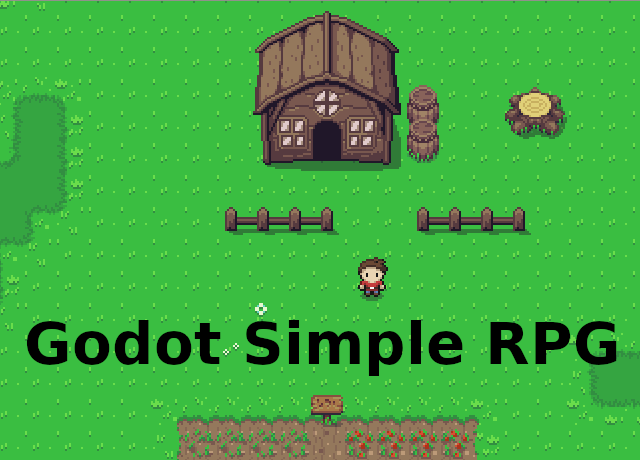

  

# Introduction

This is a very simple and modest 2D RPG created with Godot Engine, designed to be a Zelda-like game, but that could add more elements.

All the concepts here have as main goal to be flexible and allow others to design they own games.

If you have any suggestion, any feature request, please, open an issue or join us at [Discord](https://discord.gg/25yBgEZ).

> *Important*: This project uses the Godot Engine 3.1, that [you can download here](https://hugo.pro/projects/godot-builds/). 

# Contributing

## Join us at Discord

https://discord.gg/25yBgEZ

## Guidelines

This is an open source project, so all contributors are welcome. For better productivity and communication, we have some community principles that you should be aware of.

1. New features should be discussed first. So, feel free to create an issue, tag is as a *feature request* and *discussion*, so everyone could join the conversation and find if it is really desired.
2. We are following the code guideline propoused by GDQuest, that you can [check here](http://docs.godotengine.org/en/latest/getting_started/scripting/gdscript/gdscript_styleguide.html).
3. The project mantainers could refactor your code to make it compatible with the project idea and also to follow the project code style.
4. Every asset used by the project (it includes graphics, sounds, fonts, etc) should be [licenced by Creative Commons (CC0)](https://creativecommons.org/share-your-work/public-domain/cc0/)

You can check the full [Contributor's guideline](CONTRIBUTING.md).
